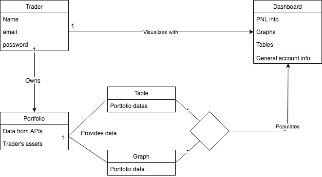

## End-User Observation
### Persona #1: Juan Fernandez

Juan is a senior at Stern studying finance. He has an investment banking job lined up for when he graduates but likes trading stocks as a hobby and for personal profit.

Juan currently has brokerage accounts at Interactive Brokers, Charles Schwab and Robinhood. Additionally, he has a Coinbase account where he sometimes trades cryptocurrencies.

Juan voices concern over not being able to visualize all his investments in a unique dashboard. He wishes he could perform analysis over all his portofolios combined in order to better understand his financial situation.

Some of the features Juan considers would benefit himself are: 
* asset allocation graphs over assets in all his portofolios
* a graph of the historical returns of:
    * all his portfolios combined
    * each portfolio by itself in order to compare them to each other

### Persona #2: Sukhpreet Singh

Sukhpreet is a senior at Iona College studying business. He is an avid forex/crypto trader and he now manages over $100,000 of his and his clients' funds.

Sukhpreet currently has multiple brokers for forex (forex.com, Oanda, Nadex) and cryptocurrencies (Coinbase Pro, Binance) and multiple accounts in each broker.

Sukhpreet would like to be able to manage his and his clients accounts in a dynamic way. Since he makes similar investments across all accounts he would like to see the total portfolio value, along with PnL charts. He would also like to use this application on his desktop or phone so that he can always monitor his performance.

Some of the features Sukhpreet considers would benefit himself are: 
* graph showing asset allocation of his portfolio with percentage breakdown of funds distributed to each
* alerts for pricing, margin and completed orders
* a breakdown for each client/account inside the total portfolio
* api integration for real-time tradingview charts for important assets

## Stakeholder Interviews

We conducted stakeholder interviews with Amos Bloomberg (professor) and Wei-Kai (tutor). During the open ended conversation we touched upon these questions and the overall response is recorded:

* Our project is meant to provide a dashboard (monitor) for trading accounts. Will this project fill up our timeline?
	* Project is sufficient and we should be able to implement 1 brokerage by the 2nd sprint
* Would people feel more comfortable with a desktop app (with a local config file) or a web-based platform?
	* Stick with a web-based dashboard. Implement the MERN stack
* Features include overall statistics, graphs, PnL charts. Should we include pricing charts? Or limit the dashboard to monitoring.
	* focus on monitoring of account information and the design (UI/UX)
* Should we focus on designing alot the features, or create an MVP dashboard and add features later
	* focus on an MVP and the features can come later
* Do we focus on the professional trader or a beginner? The functionality and UI/UX would become more complicated for professionals.
	* prioritize the design for beginner-average
* We would like to leave brokerage connections for the open-source community
	* create a template for adding brokerages (documentation) and keep the project closed but present it as open-source
* Technologies we should consider
	* D3 and DC, Crossfilter, and potentially Docker  

## Use Cases

**Title:** Check the list of portfolios

**Actor:** Trader

**Scenario:** Trader requests information on the list of portfolios. System requests most recent information all connected APIs. System displays brief and important information relating to all the portfolios. 

**Title:** Add portfolio

**Actor:** Trader, Application

**Scenario:** Trader requests to add a new portfolio to the dashboard. System requests the specific API for the portfolio. System requests the most updated data and adds the new portfolio and its information.

**Title:** Check one specific portfolio

**Actor:** Trader, Application

**Scenario1:**  Trader requests PNL information. System requests most recent numerical information on profit and losses.
**Scenario2:**  Trader requests allocation graphs. System requests most recent numerical information on allocation of total assets and displays graphical information.
**Scenario3:**  Trader requests data in a table format. System requests most recent data from APIs and displays them in a table format.
**Scenario4:**  Trader requests general account information. System requests and displays account information directly from associated APIs.

**Title:** Compare two different portfolios from dashboard

**Actor:** Trader

**Scenario:** Trader requests two portfolios to be compared. System requests the most recent information on the two portfolios selected from their APIs, displays them in each of the specific methods mentioned above. See "check one specific portfolio".

**Title:** Check summary for a period of time

**Actor:** Trader 

**Scenario:** Trade requests summary PNL for a period of time. System requests information only from selected period of time from all portfolios and compiles them into a visualizable format. 

	
## Domain Model

This is a first draft of the domain model for our project. The plan is for this to be a living document, that can change when necessary to fit project growth and change.

